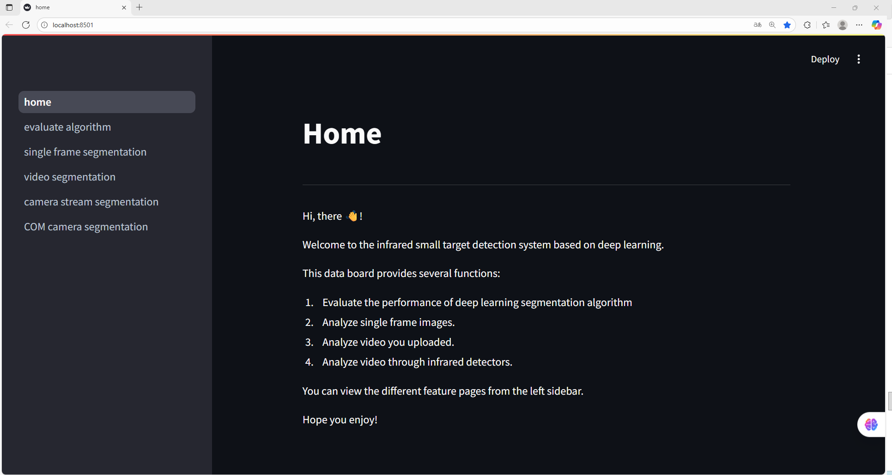

## 🚀 LW-IRSTNet: 轻量化红外小目标分割网络与全栈可视化系统

我们很高兴开源​​LW-IRSTNet​​，一个专为红外小目标分割设计的轻量级深度学习网络，以及与之配套的​​基于Streamlit开发的红外小目标全栈可视化系统​​。本项目旨在为学术界和工业界提供一个从模型推理、性能评估到结果可视化的完整解决方案，以促进交流与发展。

## 📖 模型概述

LW-IRSTNet是一个兼具高精度与低复杂度的创新模型，已获得国家发明专利授权（​​CN202310252896.1​​），并发表于​​IEEE Transactions on Geoscience and Remote Sensing​​。该网络在多个公开数据集上达到了最先进的性能，同时保持了极低的计算开销。

## ✨ 核心特性

​​🛰️ 高精度性能​​：在公开数据集上，分割精度（mIoU, F1, ROC等）均达到一流水平。

​​📱 极致的轻量化​​：仅包含​​0.16M参数量​​和​​303M FLOPs​​，非常适合边缘设备部署。

​​🔧 多平台部署​​：提供多种移动端部署格式，满足不同应用场景需求。

​​⚡ 实时处理能力​​：在小米平板6Pro等设备上可实现​​50FPS​​的实时推理速度。

## 🏆 性能亮点

与14种主流SOTA网络的对比实验表明，LW-IRSTNet：

在所有分割精度指标（mIoU, F1, ROC）上均达到或超越了基线模型的效果。

计算复杂度显著低于同类方案。

在不同数据集上均保持了强劲且鲁棒的泛化性能。

## 📦 可用模型格式

我们提供了多种预训练模型格式，方便您直接部署或集成：

​​pkl​​ (PyTorch)

​​onnx​​ (Open Neural Network Exchange)

​​ncnn​​ (Tencent NCNN)

​​tnn​​ (Tencent TNN)

​​mnn​​ (Alibaba MNN)

​​tflite​​ (TensorFlow Lite)

## 🔍 全栈可视化系统

为了更直观地展示模型效果、分析数据及进行算法对比，我们基于​​Streamlit​​开发了一套功能丰富的可视化系统。该系统具备以下功能：

​​模型推理​​：加载上述不同格式的模型，对单张图片或整个数据集进行推理。

​​结果可视化​​：并排显示原始图像、真实标签（Ground Truth）和模型预测结果。

​​性能评估​​：无缝集成下方的STD-EvalKit工具包，自动计算多项评估指标。

​​对比分析​​：支持不同模型或同一模型不同参数下的结果对比，助力算法迭代。

## 📊 评估工具包集成

我们开发了专用于红外小目标分割评估的指标工具包 ​​BinarySOSMetrics​​ （现已集成至本仓库的STD-EvalKit中），其特性包括：

​​⚡ 高效率​​：支持多线程计算。

​​🤖 设备友好​​：所有指标支持自动批次累积。

​​🔄 统一API​​：所有指标提供一致的接口（Metric.update(labels, preds)完成累积，Metric.get()获取结果），简化使用流程。

​​✅ 统一的算法实现​​：对同类型指标使用相同的计算逻辑，确保结果的可比性和可复现性。

​​🔢 多格式支持​​：支持多种输入数据格式（hwc/chw/bchw/bhwc/图像路径）。

## 支持的评估指标：

​​像素级 (Pixel-Level)​​：AUC ROC, AP PR, Precision, Recall, F1, IoU, NormalizedIoU

​​中心级 (Center-Level)​​：Precision, Recall, F1, Average Precision, Pd_Fa, ROC Pd_Fa, Center Normalized IoU

​​目标框级 (Box-Level)​​：Mean Average Precision (COCO-style), Recall

​​我们希望LW-IRSTNet模型、全栈可视化系统以及STD-EvalKit评估工具包能为您的研究与开发带来便利，期待与您的交流与合作！​
